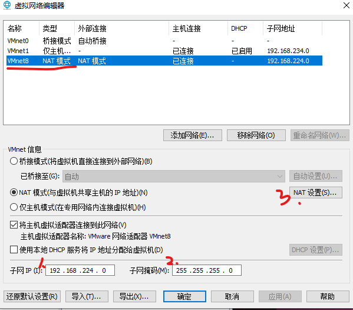

# VMware配置固定IP

VMware配置固定IP有两个步骤，

1. 在VMware中配置IP地址网关和网段（IP地址的范围）
2. 在Linux系统中手动修改配置文件，固定IP

## 1. VMware操作

VMware中，打开虚拟网络编辑器，

  

点击更改设置，

  

记录子网IP，子网掩码，打开NAT设置，

  

网关IP，

  

## 2. 虚拟机操作

进入Ubuntu，

在Ubuntu 20.04使用predictable network interface names可预测的网络接口名称标识网络接口。

查看网络接口，命令`ip addr`，

  

进入netplan目录，`cd /etc/netplan`，配置文件是一个yaml文件，文件名可能会有差异，修改前请先备份，加入以下配置，

  

ens32是网络接口名称，gateway4的地址是网关IP。

配置完成！