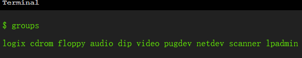

# `username is not in the sudoers file`引发的，无法执行sudo命令问题

> Linux发行版：Debian 11

执行sudo命令报错，`username is not in the sudoers file. This incident will be reported`，

是由于当前用户不在sudo组产生的权限问题，

查看当前用户所属组,

`groups`

  

不存在sudo即可确认是由该问题引起的。

接下来，将当前用户添加到sudo组即可，需要使用root用户。

切换至root用户，

`su`

将用户添加到sudo组，

`usermod -aG sudo YOUR_USERNAME`

退出root用户，

`exit`

完成添加，logout或restart即可生效。

> 查看所有sudo组用户，
> `getent group sudo`